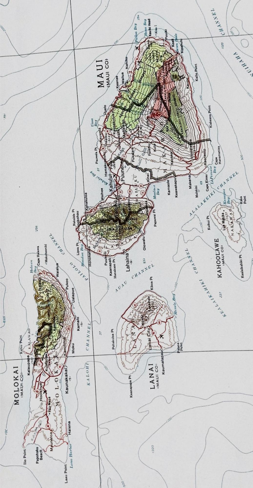

    

    <!-- <h3>Week 1</h3> -->
        
    

    

        
    

These maps are both from the U.S. Geological Survey, and they show topography and man-made features (urban areas, highways, etc.).  The map on the left is part of a map of the Hawaiian Islands, showing Maui and the ‘big island’ of Hawaii about 25 miles to the southeast.  This map is at the scale of 1:500,000, meaning one inch on the map would be 500,000 inches (about 8 miles) on land.  The other topo map is of the Lahaina area of Maui – recently devastated by a terrible wildfire.  This map is at the scale of 1:24,000, meaning one inch on the map equals 2,000 feet (about 0.4 miles).  At this scale we can see more details – elevation lines, streets, urban areas, even separate houses in rural areas (urban areas are shaded gray).  Lahaina was an old town by Hawaiian standards, and a major whaling port in the mid-1800s.  It served as the territorial capital from 1810-1845, when the capital was moved to Honolulu.  Many old buildings from those early days were still standing before the fire destroyed them.  
.

